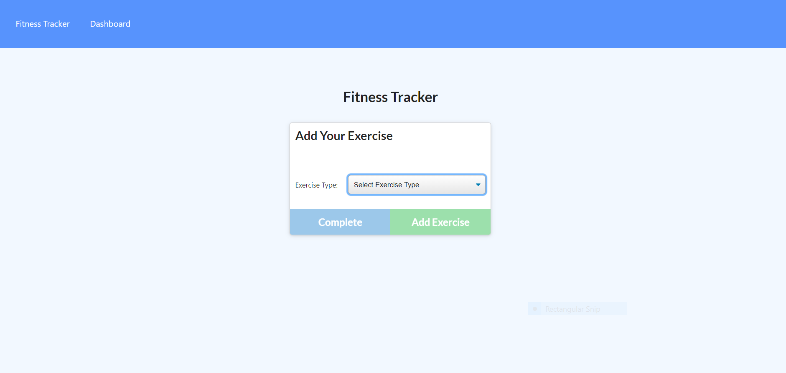
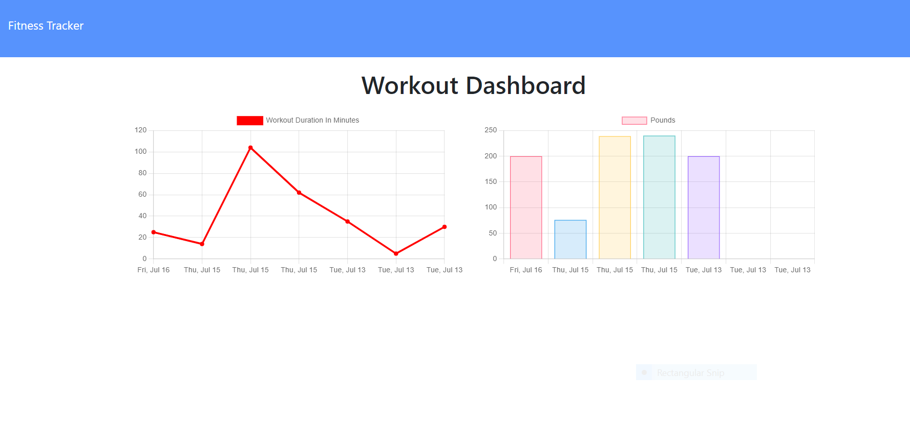

# Fitness-tracker

## PlEASE NOTE 
Navigate to this repository to see the commit hostory.
[Github](https://github.com/efagioli01/Workout-Tracker)  
I accidently cloned a new repo inside of my original repo, I then created a new repo called fitness tracker to push to Heroku which is the Github repo below in the repository section.

## Description

The goal of this project was to build a workout tracker application.The app allows users to create and track daily workouts. The user is able to log multiple exercises in a workout on a given day. They are able to track the name of the exercise, the type, weight used , how many sets, how many reps, and duration of exercise. If the exercise is cardio they can track the type of cardio, distance traveled, and the amount of time it took.

 

## Table of Contents

- [Installation](#installation)
- [Screenshot](#screenshot)
- [GitHub](#Github)
- [Credits](#credits)
- [License](#license)

 

## Installation
- Clone the respositry from Github to your local machine 
- Open up your preferred terminal and navigate to the directory where you cloned the github repository
- Run in the terminal:
- npm install
- Run npm start on the root in your terminal
- Open localhost 8000 OR ->
- Navigate to Heroku to see it live there

 

## Dependancies to Install
- morgan
- mongoose
- express

 

## Usage

Open a browser and search for localhost:8000
Open with Heroku link below and view the deployed application

 

## Screenshot
 
 )
 
 
 
 
 

## Github Repository
[Github]()

 

## Heroku

[Heroku](https://secret-coast-65510.herokuapp.com/)

 

## Credits

Collaborators - Patrick Sullivan [Github](https://github.com/shabobble) Alan Balcom [Github](https://github.com/abalcs) Swetha Redivari [Github](https://github.com/swethareddyl)

UNH Full Stack Coding Book Camp partnered with Trilogy Education Services

Course Instructor - Benjamin Hutchins

Course TA - Andrew Hatfield

Tutor - Morgan Splawn

 

## MIT License

Copyright (c) [2021] [Erica Fagioli] 

Permission is hereby granted, free of charge, to any person obtaining a copy
of this software and associated documentation files (the "Software"), to deal
in the Software without restriction, including without limitation the rights
to use, copy, modify, merge, publish, distribute, sublicense, and/or sell
copies of the Software, and to permit persons to whom the Software is
furnished to do so, subject to the following conditions:

The above copyright notice and this permission notice shall be included in all
copies or substantial portions of the Software.

THE SOFTWARE IS PROVIDED "AS IS", WITHOUT WARRANTY OF ANY KIND, EXPRESS OR
IMPLIED, INCLUDING BUT NOT LIMITED TO THE WARRANTIES OF MERCHANTABILITY,
FITNESS FOR A PARTICULAR PURPOSE AND NONINFRINGEMENT. IN NO EVENT SHALL THE
AUTHORS OR COPYRIGHT HOLDERS BE LIABLE FOR ANY CLAIM, DAMAGES OR OTHER
LIABILITY, WHETHER IN AN ACTION OF CONTRACT, TORT OR OTHERWISE, ARISING FROM,
OUT OF OR IN CONNECTION WITH THE SOFTWARE OR THE USE OR OTHER DEALINGS IN THE
SOFTWARE.

http://localhost:8000/?id=60f0f46ecf20516ea84ccf2c

